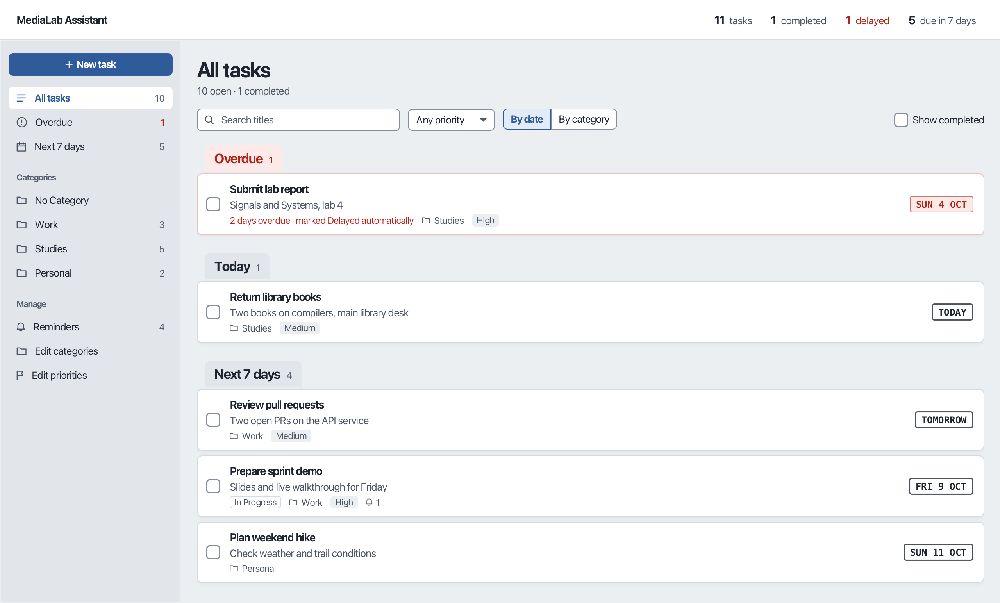
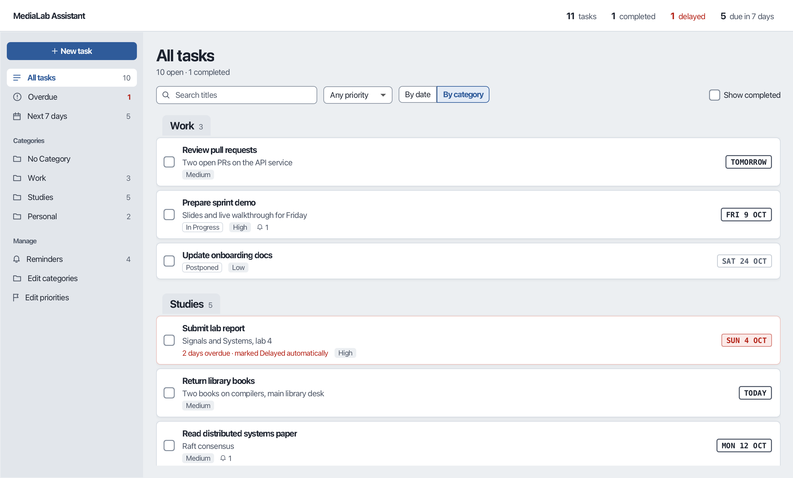
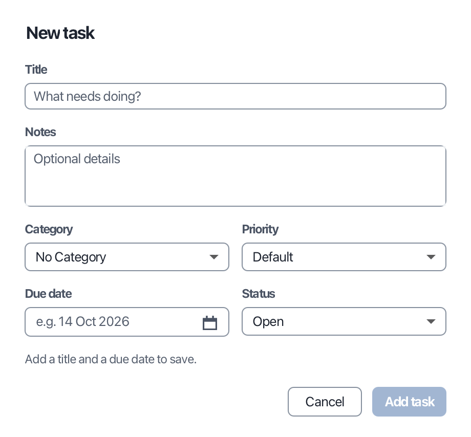
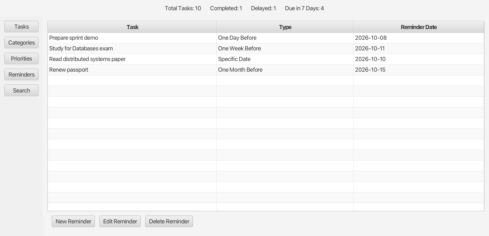

# MediaLab Assistant

[](https://github.com/eleninspl/javafx-task-manager/actions/workflows/ci.yml)

A desktop task manager built with Java 17 and JavaFX. It lets you organize tasks by category and priority, schedule reminders, and track deadlines. All data is saved locally as JSON.

I built it as the semester project for **Multimedia Technology** (Τεχνολογία Πολυμέσων), a 7th-semester course at the School of Electrical and Computer Engineering, National Technical University of Athens (ECE NTUA), academic year 2024–25.



## Features

- **Deadline-first task list**: Tasks are cards grouped into Overdue, Today, Next 7 days and Later, or by category. Each card shows its due date, priority, status and reminders. You can tick a task off right in the list.
- **Tasks**: Each task has a title, notes, category, priority, due date and status (Open, In Progress, Postponed, Completed or Delayed).
- **Deadline tracking**: When the app starts, it marks overdue unfinished tasks as Delayed. A popup lists them, with a shortcut to review them.
- **Search**: Search by any combination of title, category and priority. Results update as you type.
- **Categories and priorities**: Both are fully editable. The built-in "No Category" and "Default" can't be renamed or removed. Deleting a category also deletes its tasks; deleting a priority moves its tasks to Default. Names must be unique.
- **Reminders**: A task can have several reminders: one day, one week or one month before the due date, or on a date you choose. The dialog previews the reminder date and explains any problem before you save. Reminders follow the task when its due date changes, and are removed when it is completed or becomes Delayed. Today's reminders appear in a banner.
- **Summary bar**: The top bar shows the total number of tasks, completed, delayed, and due within 7 days. Click a count to open that view.
- **Keyboard support**: <kbd>⌘/Ctrl</kbd>+<kbd>N</kbd> new task, <kbd>⌘/Ctrl</kbd>+<kbd>F</kbd> search, <kbd>Enter</kbd> edit, <kbd>Space</kbd> complete, <kbd>Delete</kbd> delete. Every field has a mnemonic, and every row has a right-click menu.
- **Autosave**: Every change is saved immediately. Files are written atomically, so a crash can't leave a half-written data file.

| Grouped by category | New task | Reminders |
|---|---|---|
|  |  |  |

## Tech stack

| Area        | Technology                          |
|-------------|-------------------------------------|
| Language    | Java 17                             |
| UI          | JavaFX 21 (layouts in code, one CSS theme) |
| Persistence | JSON via Gson 2.10                  |
| Testing     | JUnit 5                             |
| Build / CI  | Maven, GitHub Actions               |

## Architecture

The code is split into layers so that business rules do not depend on the UI:

```
io.github.eleninspl.taskmanager
├── App.java              Entry point: wires services and controllers, builds the main window
├── model/                Task, Category, Priority, Reminder, plus TaskStatus and ReminderType enums
├── service/              Business rules and in-memory state (CRUD, cascades, reminder validation)
├── controller/           Screens: task list, sidebar, reminders, categories, priorities
│   └── dialog/           Create and edit dialogs with inline validation
├── ui/                   Theme loading, icons, shared dialog helpers
└── storage/              JsonStorage (Gson) and a LocalDate type adapter
resources/.../app.css     The visual theme: colours, type scale, cards, stamps
```

- **Services** keep their data in JavaFX `ObservableList`s, so every view updates automatically when the data changes.
- **TaskQuery** holds the search criteria and the grouping into sections. It has no UI code, so it is unit-tested directly.
- **Cross-entity rules** are handled in the service layer, not the controllers. Examples: deleting a category also deletes its tasks and their reminders, and changing a due date recalculates reminders.
- **Persistence**: Data is loaded at startup. Any change to a list triggers a save, and changes made in the same UI event (for example a category delete that also removes its tasks and reminders) are batched into one write. After loading, each task is linked back to the shared category and priority objects, so a rename shows up everywhere.

## Getting started

### Prerequisites

- JDK 17 or later
- Maven 3.8 or later

### Run

```bash
git clone https://github.com/eleninspl/javafx-task-manager.git
cd javafx-task-manager
mvn javafx:run
```

Data is stored in `~/medialab/` (the assignment requires a folder named `medialab`) as four JSON files: `tasks.json`, `categories.json`, `priorities.json` and `reminders.json`. To use a different folder, for example a throwaway demo dataset, set the `medialab.dataDir` system property.

### Test

```bash
mvn test
```

The tests cover the service layer, search and storage: overdue detection, reminder validation, editing and recalculation, name rules, cascading deletes, protected defaults, grouping and filtering, JSON round-trips, and reference linking after a reload. CI runs the build and tests on Linux, Windows and macOS for every push.

## Documentation

- [`docs/report.pdf`](docs/report.pdf): Project report covering features, design and data model (in Greek)

## Design assumptions

- The default category and the default priority always exist and cannot be changed.
- Users cannot set Delayed themselves. The status is assigned automatically from the due date.
- Due dates are dates only, with no time of day.
- Data is saved after every change rather than only on exit, as the original assignment specified. This is a deliberate change, so a crash or forced quit never loses work.
