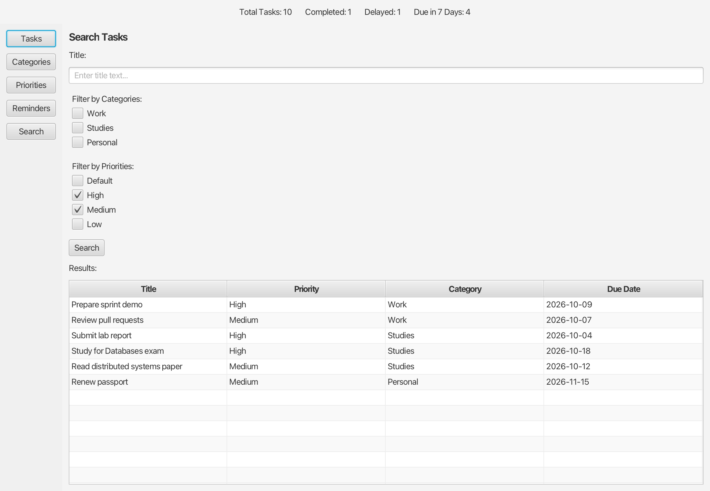

# MediaLab Assistant

[](https://github.com/eleninspl/javafx-task-manager/actions/workflows/ci.yml)

A desktop task manager built with Java 17 and JavaFX. It lets you organize tasks by category and priority, schedule reminders, and track deadlines. All data is saved locally as JSON.

I built it as the semester project for **Multimedia Technology** (Τεχνολογία Πολυμέσων), a 7th-semester course at the School of Electrical and Computer Engineering, National Technical University of Athens (ECE NTUA), academic year 2024–25.


## Features

- **Tasks**: Create, edit and delete tasks. Each task has a title, description, category, priority, due date and status (Open, In Progress, Postponed, Completed or Delayed).
- **Deadline tracking**: Overdue tasks that are not completed are marked Delayed, and the user is warned at startup.
- **Categories and priorities**: Fully editable. A protected default ("No Category" / "Default") cannot be renamed or removed. Deleting a category also deletes its tasks. Deleting a priority moves its tasks to the default priority.
- **Reminders**: A task can have several reminders: one day, one week or one month before the due date, or on a custom date. Reminder dates are validated against the due date and today's date. When a task's due date changes, its reminders are recalculated. When a task is completed or becomes delayed, its reminders are removed. Reminders due today appear in a dialog at startup.
- **Search**: Filter tasks by any combination of title, category and priority.
- **Dashboard**: The header shows totals for all tasks, completed tasks, delayed tasks and tasks due in the next 7 days. It updates as you make changes.
- **Autosave**: Every change is saved immediately. Files are written atomically, so a crash cannot leave a half-written data file.

| Search | Reminders |
|--------|-----------|
|  |  |

## Tech stack

| Area        | Technology                          |
|-------------|-------------------------------------|
| Language    | Java 17                             |
| UI          | JavaFX 21 (layouts written in code) |
| Persistence | JSON via Gson 2.10                  |
| Testing     | JUnit 5                             |
| Build / CI  | Maven, GitHub Actions               |

## Architecture

The code is split into layers so that business rules do not depend on the UI:

```
io.github.eleninspl.taskmanager
├── App.java              Entry point: wires services and controllers, builds the main window
├── model/                Task, Category, Priority, Reminder, plus TaskStatus and ReminderType enums
├── service/              Business rules and in-memory state (CRUD, cascades, reminder validation)
├── controller/           One controller per screen (Tasks, Categories, Priorities, Reminders, Search)
│   └── dialog/           Create and edit dialogs
└── storage/              JsonStorage (Gson) and a LocalDate type adapter
```

- **Services** keep their data in JavaFX `ObservableList`s, so the table views update automatically when the data changes.
- **Cross-entity rules** are handled in the service layer, not the controllers. Examples: deleting a category also deletes its tasks and their reminders, and changing a due date recalculates reminders.
- **Persistence**: Data is loaded at startup. Any change to a list triggers a save, and changes made in the same UI event (for example a category delete that also removes its tasks and reminders) are batched into one write. After loading, each task is linked back to the shared category and priority objects, so a rename shows up everywhere.

## Getting started

### Prerequisites

- JDK 17 or later
- Maven 3.8 or later

### Run

```bash
git clone https://github.com/eleninspl/javafx-task-manager.git
cd javafx-task-manager
mvn javafx:run
```

Data is stored in `~/.medialab-assistant/` as four JSON files: `tasks.json`, `categories.json`, `priorities.json` and `reminders.json`. To use a different folder, for example a throwaway demo dataset, set the `medialab.dataDir` system property.

### Test

```bash
mvn test
```

The tests cover the service layer and storage: overdue detection, reminder validation and recalculation, cascading deletes, protected defaults, JSON round-trips, and reference linking after a reload. CI runs the build and tests on Linux, Windows and macOS for every push.

## Documentation

- [`docs/report.pdf`](docs/report.pdf): Project report covering features, design and data model (in Greek)

## Design assumptions

- The default category and the default priority always exist and cannot be changed.
- Users cannot set Delayed themselves. The status is assigned automatically from the due date.
- Due dates are dates only, with no time of day.
